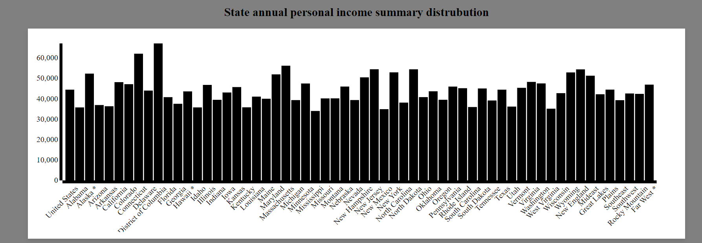
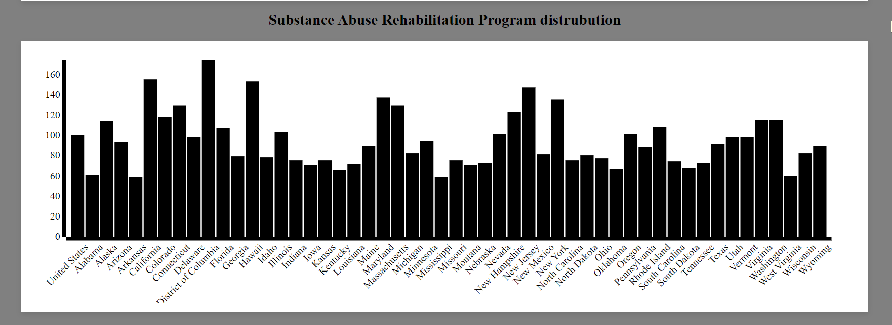
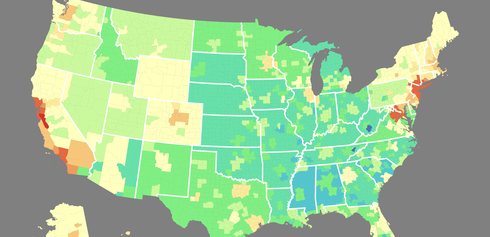
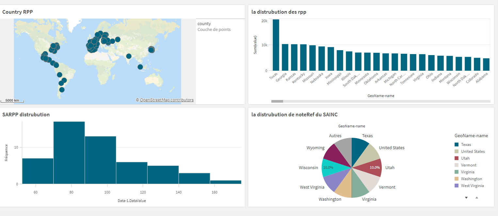

# Visualisation des données économiques des États-Unis avec d3.js et l'API BEA

Ce projet vise à explorer les données économiques des États-Unis en utilisant la bibliothèque de visualisation JavaScript d3.js en conjonction avec l'API REST fournie par le Bureau of Economic Analysis (BEA). L'objectif principal est de créer des visualisations interactives et informatives du Revenu Personnel (RPP), du Produit Intérieur Brut (PIB) de l'Industrie Non Agricole (SAINC) et du Produit Intérieur Brut (PIB) de l'Industrie Agricole (SARPP) des États-Unis.
## Fonctionnalités

- **Visualisations interactives** : Création de visualisations interactives utilisant d3.js pour représenter les données économiques des États-Unis de manière dynamique.

- **Affichage du Revenu Personnel (RPP)** : Présentation des données sur le Revenu Personnel (RPP) des États-Unis sous forme de graphiques et de tableaux interactifs pour une compréhension approfondie des tendances.

- **Analyse du Produit Intérieur Brut (PIB)** :
    - **Industrie Non Agricole (SAINC)** : Visualisation du Produit Intérieur Brut (PIB) de l'Industrie Non Agricole des États-Unis pour explorer les performances économiques sectorielles.
    - **Industrie Agricole (SARPP)** : Analyse du Produit Intérieur Brut (PIB) de l'Industrie Agricole des États-Unis pour comprendre les contributions du secteur agricole à l'économie.

## Technologies Used

- HTML
- JavaScript
- D3.js for data visualization
- css
- Qlick Sense

## Utilisation

Pour utiliser ce projet, veuillez suivre les étapes suivantes :

1. Clonez ce repository sur votre machine locale.
2. Ouvrez le fichier `country.html` dans un navigateur web pour accéder aux visualisations.

## Exemples d'Utilisation

Voici quelques captures d'écran illustrant les fonctionnalités de l'application :

- **Histogramme de SAINC1** : La première capture d'écran affiche un histogramme représentant la distribution du SAINC1.
  . 

- **Histogramme de SARPP** : La deuxième capture d'écran présente un histogramme montrant la distrubution du SARPP.
  .

- **Carte** : La carte de distribution des dollars est une représentation visuelle interactive qui met en évidence la répartition géographique des dollars dans l'économie des États-Unis. Cette carte utilise des données provenant de l'API du Bureau of Economic Analysis (BEA) pour identifier les régions et les États qui contribuent le plus au Revenu Personnel (RPP) et au Produit Intérieur Brut (PIB) de l'Industrie Non Agricole (SAINC) et Agricole (SARPP).

Ces captures d'écran illustrent les différentes fonctionnalités de l'application, offrant ainsi un aperçu de son utilisation et de ses capacités.

## Feuille récapitulative (Qlik Sense)

En plus du Résumé Météorologique, cette feuille récapitulative comprend plusieurs visualisations clés pour analyser les données économiques :

1. **Carte du Monde RPP :** Cette visualisation présente une carte mondiale mettant en évidence la présence du Revenu Personnel par Pays (RPP). Des points bleus de différentes tailles sont utilisés pour symboliser la concentration du RPP dans chaque pays, offrant ainsi une vue globale de la répartition du revenu à l'échelle mondiale.

2. **Barres des RPP :** Ce graphique en barres montre la distribution du Revenu Personnel (RPP) dans divers pays ou régions. Les nuances de bleu sont utilisées pour représenter différentes quantités de RPP, permettant une comparaison visuelle des niveaux de revenu entre les régions.

3. **Histogramme SARPP :** Un histogramme présentant la distribution des valeurs SARPP sur l’axe des abscisses et leur fréquence sur l’axe des ordonnées, avec des barres de couleur teal.

4. **Camembert SAINC :** Un diagramme circulaire illustrant la distribution du Produit Intérieur Brut de l’Industrie Non Agricole (SAINC) entre différents États américains, avec des segments colorés et étiquetés par pourcentage.
